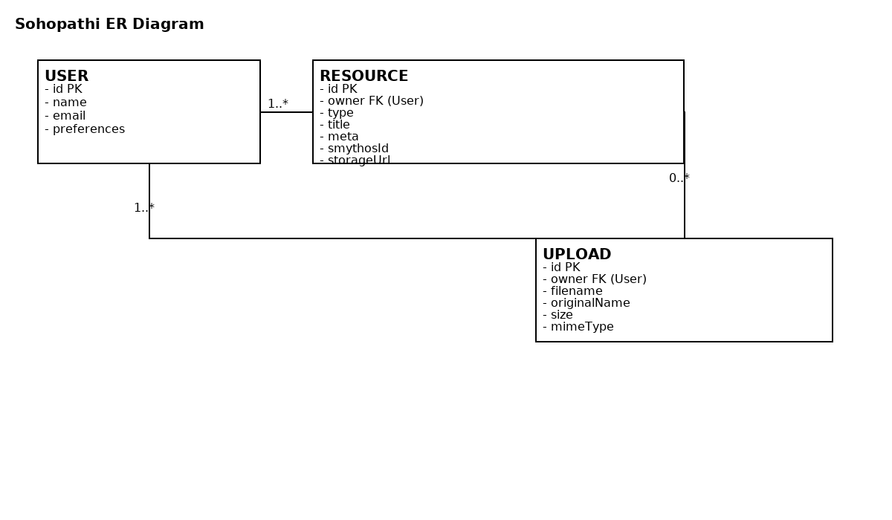

# Sohopathi Accessibility Assistant — MERN Project

Sohopathi is an AI-powered accessibility assistant designed to help students with disabilities. It integrates **SmythOS Agents** with a modern **MERN stack** application (MongoDB, Express.js, React.js, Node.js) and provides accessibility features like Dyslexic Support, Sign Language videos, Audiobooks, Live Captioning, Social Story Creator, Image Description, Math Support, Emotion Coaching, and Communication Boards.

---

## 🚀 Features

* Full-stack MERN app with secure backend and responsive frontend.
* SmythOS Agent integration for AI-powered accessibility skills.
* MongoDB storage for users, uploads, and generated content.
* JWT-based authentication.
* Docker support for easy deployment.

---

## 📂 Project Structure

```
sohopathi-root/
│   docker-compose.yml
│   README.md (this file)
│   ER_diagram.png
│
├── backend/
│   ├── server.js
│   ├── package.json
│   ├── .env.example
│   ├── routes/
│   ├── controllers/
│   ├── models/
│   ├── middleware/
│   └── services/
│
├── frontend/
│   ├── public/
│   ├── src/
│   │   ├── components/
│   │   ├── pages/
│   │   ├── services/
│   │   └── App.js
│   └── package.json
```

---

## 🐳 Run with Docker Compose (Recommended)

### 1. Install prerequisites

* [Docker Desktop](https://www.docker.com/products/docker-desktop) (Windows/Mac)
* Or Docker CLI + `docker-compose` plugin (Linux)

Check versions:

```bash
docker --version
docker compose version
```

### 2. Configure environment

Copy the example environment file:

```bash
cp backend/.env.example backend/.env
```

Edit `backend/.env` with your keys:

```env
MONGO_URI=mongodb://mongo:27017/sohopathi
JWT_SECRET=supersecret
SMYTHOS_API_KEY=your_key_here
SMYTHOS_URL=https://api.smythos.com/agent
```

### 3. Build and run

```bash
docker compose up --build
```

* Backend → [http://localhost:5000](http://localhost:5000)
* Frontend → [http://localhost:3000](http://localhost:3000)
* MongoDB runs inside Docker (container name: `mongo`).

### 4. Test

Open browser or Postman:

```http
GET http://localhost:5000/api/auth/test
```

Should return `{ "message": "Auth working" }`

---

## 💻 Run Without Docker (Manual)

### 1. Backend setup

```bash
cd backend
npm install
cp .env.example .env
```

Edit `.env` and run:

```bash
npm run dev
```

Backend → [http://localhost:5000](http://localhost:5000)

### 2. Frontend setup

```bash
cd ../frontend
npm install
npm start
```

Frontend → [http://localhost:3000](http://localhost:3000)

Make sure API base URL in `frontend/src/services/api.js` is:

```js
const API = axios.create({ baseURL: "http://localhost:5000/api" });
```

---

## 📖 ER Diagram



### Entities

* **User** → stores authentication and profile info.
* **Resource** → generated outputs (storybook, audiobook, etc).
* **Upload** → files/images provided by users.
* Relationships: User ↔ Upload ↔ Resource.

---

## 🎨 Demo Flow

1. User signs up and logs in.
2. Uploads text, audio, or image.
3. Chooses accessibility service (e.g., Dyslexic Support, Audiobook).
4. Backend calls SmythOS API and stores results.
5. Frontend displays output in accessible format (storybook, captions, etc).

---

## ⚡ Hackathon Tips

* Judges love **one-command setup**: use Docker Compose.
* Prepare short **demo flows** for each skill.
* Show off **ER Diagram + Accessibility-First UI** in your presentation.
* Add sample test data (we included seed routes for quick testing).

---

## 📸 Screenshots (Add Yours)

* Frontend home page
* Example: Dyslexic storybook output
* Example: Live captions in real-time
* Example: Math problem solver step-by-step

---

## 📜 License

Open-source for hackathon use. Add license terms as required.

---

### 👩‍💻 Contributors

* **Hackathon Team Sohopathi**
